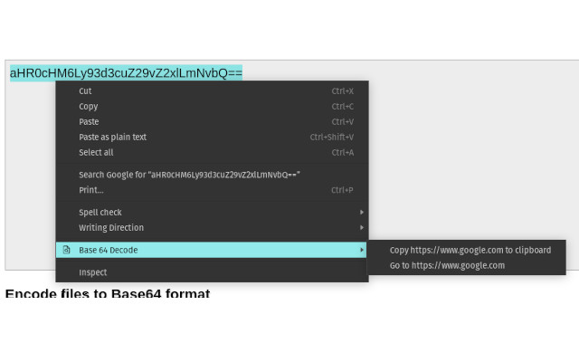

# Base64 Decode

A chrome extension for decoding base64 encoded strings, and opening base 64 encoded urls.

[Check it out on the chrome webstore](https://chrome.google.com/webstore/detail/base-64-decode/cjjhhjjoenldlkfbdinpigfcpkhijhco)

Have you ever needed to use base 64 decode on text in a web page? How about visiting a URL that is base 64 encoded?

This extension adds menu items for your right-click context menu when you select text that is base64 encoded on a page.



